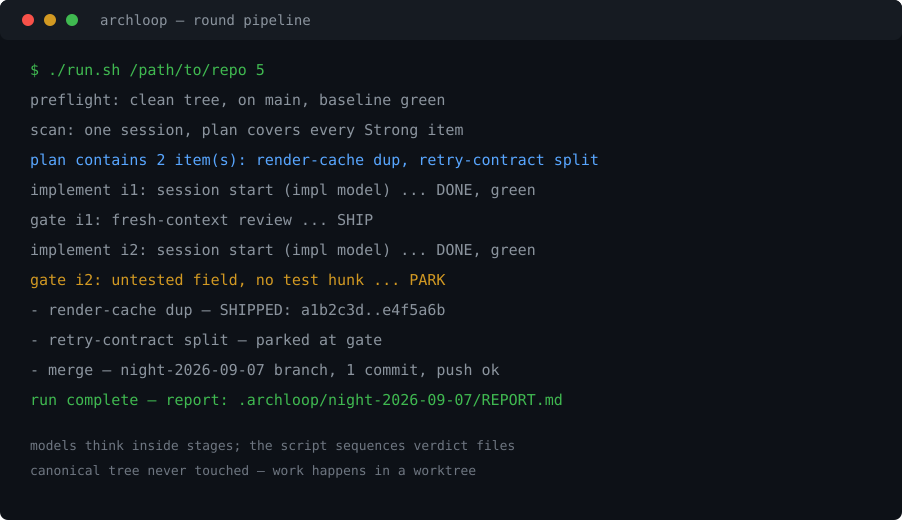
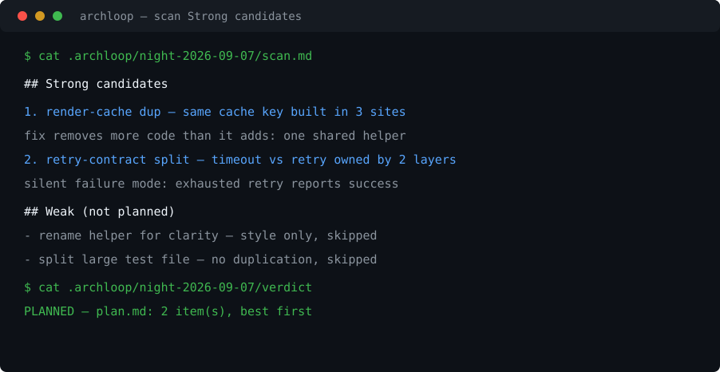

# archloop

[](https://github.com/andrepontesmelo/archloop/actions/workflows/ci.yml)


Unattended overnight architecture-improvement loop for a git repository. A deterministic
bash state machine automates [Matt Pocock's](https://www.mattpocock.dev) improve-architecture
skill: it runs the skill, triggers an `opencode` session to implement each Strong
suggestion, and follows each implementation with a fresh-context review — until the codebase
scan reports no Strong candidates left.

## What it does

`archloop-loop.sh` re-runs `run.sh` against a target repo until the scan reports no Strong
candidates, or the `MAX_ROUNDS` safety cap is hit (default 8 — PARKED items can be
re-proposed, so the cap stops a night that never converges).

Each `run.sh` round walks a fixed pipeline:

1. **Preflight** — abort unless the canonical checkout is clean, on `main`, and baseline
   tests + lint are green. The canonical tree is never touched.
2. **Scan** — one session reads the architecture-scan skill and lists **Strong candidates**
   (duplication or split contracts spanning 3+ sites, or a silent failure mode; the fix
   must remove more code than it adds). One plan covers every Strong candidate, best
   first. Nothing qualifies → `NONE` verdict, stop.
3. **Implement** — one session per item, in an isolated worktree, keeping tests + lint
   green.
4. **Gate** — one fresh-context review session per item. `SHIP` or `PARK` per item; a
   PARK resets the branch and costs one item, not the night.
5. **Merge + push** — SHIPped items merge `--no-ff` back into `main` and push at the end
   of the run (`ARCHLOOP_MERGE=0` / `ARCHLOOP_PUSH=0` disable).

Every stage reads and writes files under the repo's `.archloop/` directory — artifacts,
not memory. The run is crash-restartable and fully auditable.

The orchestrator is a script, not a model: the sequence is a fixed state machine —
deterministic, free, restartable, immune to overnight context rot. Models think inside
stages; the script sequences them and greps one-word verdict files. One fresh `opencode
run` session is one stage boundary.

## Why it exists

Architecture debt is exactly the work nobody picks up: suggestions sit in review, and the
sessions that could apply them never start. archloop makes the loop unattended: scan,
implement, review, repeat — every night if you want, with every change gated by a
fresh-context review before it can merge.

## Screenshots



> PLACEHOLDER screenshot — mock drafted from documented example values; swap for a real capture at review.



> PLACEHOLDER screenshot — mock drafted from documented example values; swap for a real capture at review.

## Install

Clone and run — no package, no dependencies beyond bash, git, and an
`opencode` binary on PATH with a configured model:

```bash
git clone https://github.com/andrepontesmelo/archloop
cd archloop
```

There is no tarball release, so there is no checksum to verify — pin a tag
or commit for reproducibility instead of floating on a branch:

```bash
git checkout <tag-or-commit>   # pin what you run, especially overnight
```

> [!WARNING]
> The loop drives sessions that implement code and run reviews in worktrees:
> it never touches the canonical tree, but it executes agent-written code.
> Review the target repo's `.archloop/config` before unattended overnight
> runs — a wrong test/lint command or model id burns quota or merges surprises.
> Model credentials are required in the session runner's config.

Verify the install with the zero-quota gate (no model calls, no keys needed):

```bash
bash scripts/stub-validation.sh   # 25 assertions across 6 scenarios
```

Useful commands:

```bash
bash scripts/stub-validation.sh   # the local gate — run before every push
bash scripts/concurrency-proof.sh # local-only parallel double-run evidence (not a CI step)
./run.sh /path/to/repo [max_items]
./archloop-loop.sh /path/to/repo [max_items] [max_rounds]
```

## Quick start

```bash
# one round: scan → implement → gate → merge
./run.sh /path/to/repo [max_items]

# loop until no Strong candidates remain (or MAX_ROUNDS hit)
./archloop-loop.sh /path/to/repo [max_items] [max_rounds]
```

Optional per-repo config is read from the target's `.archloop/config` (model overrides,
merge/push toggles, night label). Artifacts land in the target's `.archloop/` — add
`.archloop/` to the repo's `.git/info/exclude` (the loop driver does this itself if it's
missing).

## Docs

Start at the [docs index](docs/index.md):

- [Architecture](docs/architecture.md) — pipeline, pieces, verdict contract, sequence.
- [Development](docs/development.md) — layout, the local gate, conventions, pre-push checklist.

## Contributing

PRs welcome — see [CONTRIBUTING.md](CONTRIBUTING.md) for the workflow and the local gate.
Security issues: [SECURITY.md](SECURITY.md) (do not open a public issue).

## Roadmap

- **Harness-generic orchestration** — today each stage is one `opencode run` session.
  Next step: make the runner generic across harnesses — DeepSeek, Claude Code, opencode,
  Codex, Hermes — so any of them can execute the stages.

## Requirements

- Bash and git; an `opencode` binary on PATH with a configured model.

## License

MIT — see [LICENSE](LICENSE).
