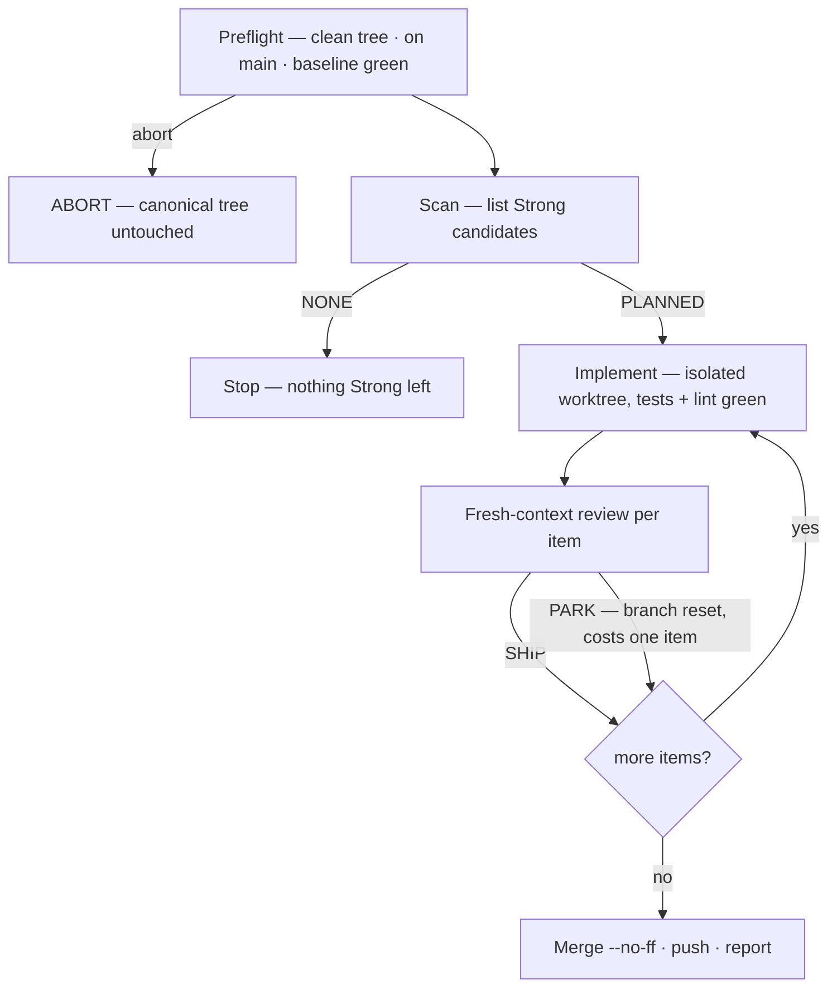

# archloop

[](https://github.com/andrepontesmelo/archloop/actions/workflows/ci.yml)

## What it does

Unattended overnight loop that eats architecture debt in a git repository. It automates [Matt Pocock's](https://www.mattpocock.dev) improve-codebase-architecture skill — Pocock is a well-known TypeScript educator, and his skill scans a codebase for **deepening opportunities**: refactors that turn shallow modules (interface nearly as complex as the implementation) into deep ones, where a small interface hides a lot of behaviour. archloop keeps applying what that scan finds until it reports nothing strong left.

What that looks like over a few nights:

- You wake up to reviewed-and-merged improvements. Every change was checked by a fresh-context review session in its own worktree before it could merge, and a park (a review that said no) resets the branch without losing the night.
- Architecture debt never accumulates. The scan's bar is deliberate — duplication or a split contract spanning 3+ sites, or a silent failure mode where drift produces no error and no failing test — and it only takes a candidate whose fix removes more code than it adds. Nothing speculative gets merged; if nothing qualifies, the loop honestly reports `NONE` and stops.
- The canonical tree is never touched. All implementation happens in isolated worktrees, every stage reads and writes artifacts under the target's `.archloop/` directory (files, not model memory), and the run is crash-restartable and fully auditable.

The orchestrator is a deterministic bash script, not a model: it sequences the stages, and models do the thinking inside each one. That makes it free to restart, immune to overnight context rot, and greppable — one fresh session is one stage boundary.

One round of the loop, simplified:


```mermaid
flowchart TD
    P["Preflight — clean tree · on main · baseline green"] -->|"abort"| X["ABORT — canonical tree untouched"]
    P --> S["Scan — list Strong candidates"]
    S -->|"NONE"| D["Stop — nothing Strong left"]
    S -->|"PLANNED"| I["Implement — isolated worktree, tests + lint green"]
    I --> G["Fresh-context review per item"]
    G -->|"SHIP"| N{"more items?"}
    G -->|"PARK — branch reset, costs one item"| N
    N -->|"yes"| I
    N -->|"no"| M["Merge --no-ff · push · report"]
```

## When to reach for it

- You have a repo whose review queue keeps filling with refactor suggestions nobody picks up — this makes that loop unattended: scan, implement, review, merge, repeat, every night if you want.
- You want AI-implemented refactors without AI-merged surprises: each candidate ships only after a fresh-context review in its own worktree says `SHIP`.
- Your repo is testable enough that "keep tests and lint green" is a real signal (the pipeline leans on it at every step).
- You want the loop to converge on its own — it stops at `NONE`, or at the `MAX_ROUNDS` cap (default 8, because PARKED items can be re-proposed, so the cap stops a night that never converges).

Skip it if you need cross-repo coordination, interactive design work, or if the repo has no green baseline — the preflight aborts unless tests and lint pass before the first scan.

## Install

Clone and run — no package, no dependencies beyond bash, git, and an `opencode` binary on PATH with a configured model:

```bash
git clone https://github.com/andrepontesmelo/archloop
cd archloop
git checkout <tag-or-commit>   # pin what you run, especially overnight
```

There is no tarball release, so there is no checksum to verify — pin a tag or commit for reproducibility instead of floating on a branch.

> [!WARNING]
> The loop drives sessions that implement code and run reviews in worktrees: it never touches the canonical tree, but it executes agent-written code. Review the target repo's `.archloop/config` before unattended overnight runs — a wrong test/lint command or model id burns quota or merges surprises. Model credentials are required in the session runner's config.

Nightly, unattended — install once, runs 02:17 every night:

```bash
( crontab -l 2>/dev/null; echo "17 2 * * * /path/to/archloop/archloop-loop.sh /path/to/target-repo" ) | crontab -
```

Scheduled runs self-log into the target's `.archloop/loop-driver.log`. A systemd user timer alternative, per-repo config (model overrides, merge/push toggles), and where artifacts land: [docs/nightly.md](docs/nightly.md).

## It's working if

The zero-quota gate passes (no model calls, no keys needed):

```bash
bash scripts/stub-validation.sh   # 25 assertions across 6 scenarios
```

## Known limitations

- **One harness.** Each stage is one `opencode run` session. Harness-generic orchestration (DeepSeek, Claude Code, Codex, Hermes) is the roadmap item.
- **English-centric verdicts.** The script greps one-word verdict files (`NONE`, `SHIP`, `PARK`) — the contract is simple, not multilingual.
- **Needs a green baseline.** Preflight aborts if tests or lint fail, so a red repo is unreachable until it's green.
- **PARK is a retry, not a reject.** A parked item resets the branch and costs one item; the next night's scan may re-propose it if it still qualifies.

Docs: [architecture](docs/architecture.md) · [nightly runs](docs/nightly.md) · [development](docs/development.md) — Contributing: [CONTRIBUTING.md](CONTRIBUTING.md) · Security: [SECURITY.md](SECURITY.md) · License: MIT ([LICENSE](LICENSE)).
